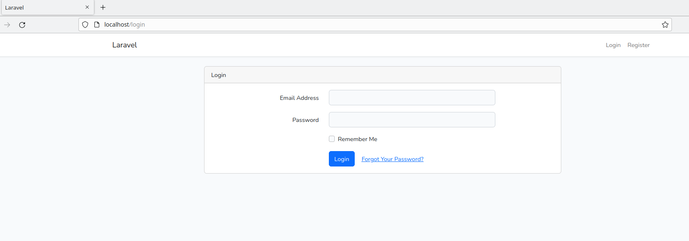

Пока что артизан запускать внутри контейнера, надо сделать проще и удобнее

Потенциальную проблему с доступам к файлам внутри смонитрованного каталога storage модно решить через команды

<h1>Команды ниже выполнять на host машине без перезапуска контейнеров</h1>

1) `sudo chmod -R gu+w storage`
2) `sudo chmod -R guo+w storage`
3) `php artisan cache:clear`

Запуск:
Запуск осуществляется последовательно: сначала поднимаются сервисы бекенда,
после чего нужно вручную запустить фронт
1) `./vendor/bin/sbin up`
2) `npm install`
3) `npm run dev`

В бразуере нужно открыть http://localhost/login

<h2>TODO</h2>
1) Реализовать команду, которая будет проводить операции из очереди(базы)
2) Добавить сортировку по дате на странице операций
3) Добавить поиск по описанию на страницу операций
4) Написать тесты, отрефакторить, собрать релиз
